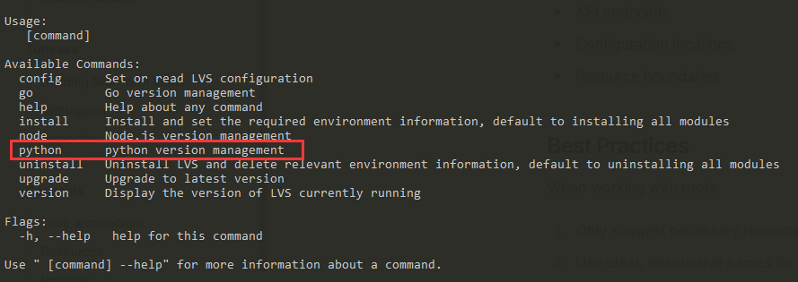
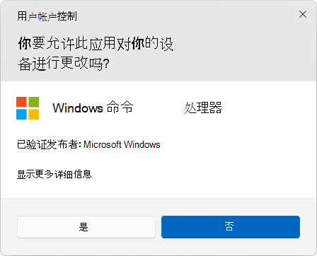

<div align="center"></div>

<h1 align="center" style="border-bottom: none;">LVS</h1><h3 align="center" style="border-bottom: none;">Lightweight Version Suite(Love SHX)</h3>

# 一、简介

<p align="center">
  <a href="https://github.com/jianggujin/lvs/blob/master/LICENSE">
    
  </a>
  <a href="https://github.com/jianggujin/lvs">
    
  </a>
  <a href="https://github.com/jianggujin/lvs/releases">
    
  </a>
  <a href='https://github.com/jianggujin/lvs'>
    </a>
</p>


`LVS`是基于`Go`语言开发的适应于`node.js`、`Go`语言的版本管理工具，以满足开发中对不同版本的依赖要求，同时支持自定义对其他类似需求的软件进行版本管理。

`LVS`原理如下：

1. **自动配置环境变量**：根据需要使用的程序类型，自动像环境变量中注入所需信息，例如：`node.js`需要`NODE_HOME`，而`Go`需要`GOROOT`和`GOPATH`，最后在`Path`环境变量中添加相关环境变量的引用以实现在系统任意位置可使用相关命令。`LVS`会自动配置这些环境变量，在`Windows`系统中通过修改注册表实现、`Linux`与`Mac`系统中通过修改终端的配置文件，导出相关的环境变量信息。
2. **版本指向(符号链接)**：手动切换版本时，往往需要将对环境变量进行修改，在`LVS中`借鉴了`nvm`的思路，初始安装时仅需要配置一次环境变量，将程序的安装目录指向一个符号连接(`Windows`系统中为快捷方式)，后续切换版本时仅需要修改符号链接的目标文件即可完成版本的切换。

# 二、安装

下载地址：[Github](https://github.com/jianggujin/lvs/releases)|[Gitee](https://gitee.com/jianggujin/lvs/releases)

## 2.1 Windows

从下载页面下载所需版本的`Windows`版本程序，将其重命名为`lvs.exe`后移动至自定义目录，进入该目录运行如下命令：

```shell
lvs install
```

如需安装其他模块请参考[3.2 install](#3.2-install)部分

## 2.2 Linux/MacOS

`Linux`/`MacOS` 上可以从下载地址页面中选择所需版本的二进制包来使用。通过如下命令进行下载：

```shell
sudo curl -L "https://${域名}/jianggujin/lvs/releases/download/${版本}/lvs-${os}-${arch}" -o ~/lvs
```

根据实际情况替换上述命令中的`${}`内容。

将可执行权限应用于二进制文件：

```shell
sudo chmod +x ~/lvs
```

进入`LVS`程序所在目录，运行安装命令即可：

> **建议**：`LVS`会尝试判断当前系统的终端类型以及配置文件，在安装之前建议使用`lvs config`命令查看`SHELL_TYPE`与`SHELL_CONFIG_PATH`的值是否正确，若该值为空或与实际不符，建议对其进行修改后再执行安装操作，详情参见[3.1 config](#3.1-config)部分

```sh
./lvs install
```

# 三、命令说明

`LVS`尽量保持在各系统中的表现一致，若存在差异，将在对应命令说明中标出。

## 3.1 config

用于设置或读取`LVS`的配置信息，如果参数仅包含`LVS`的配置名称则表示读取指定的配置，否则为设置指定的配置。示例如下：

```shell
lvs config                     # 列出所有配置
lvs config DATA_HOME           # 读取配置
lvs config DEFAULT_COMMAND go  # 写入配置
```

配置列表示例结果如下：

```
|       NAME       |            VALUE             |    MODE    |
|------------------|------------------------------|------------|
|    DATA_HOME     |            ~/.lvs            | read/write |
| DEFAULT_COMMAND  |                              | read/write |
|     GO_HOME      |     ~/.lvs/repository/go     | read/write |
|    GO_MIRROR     | https://golang.google.cn/dl/ | read/write |
|     GO_PROXY     |                              | read/write |
|    NODE_HOME     |   ~/.lvs/repository/nodejs   | read/write |
| NODE_NODE_MIRROR |   https://nodejs.org/dist/   | read/write |
|    NODE_PROXY    |                              | read/write |
|   NODE_SYMLINK   |    ~/.lvs/symlink/nodejs     | read/write |
|      PROXY       |                              | read/write |
|   SCRIPT_HOME    |        ~/.lvs/script         | read/write |
|    TEMP_HOME     |         ~/.lvs/temp          | read/write |
```

- **NAME**: 配置名称
- **VALUE**：配置值
- **MODE**
  - **read**: 可读
  - **write**: 可写

配置信息说明：

|        名称         | 说明                                                         | 默认值                         |      系统       |
| :-----------------: | ------------------------------------------------------------ | ------------------------------ | :-------------: |
|     `DATA_HOME`     | `LVS`数据存储目录                                            | `~/.lvs`                       |                 |
|  `DEFAULT_COMMAND`  | 默认命令，以`node`为例，使用其相关命令时需要使用`lvs node`形式，如果我们希望快捷执行，省略`node`部分，可以将该配置设置为`node`，则后续可直接使用`lvs use`形式执行node版本的切换操作，所有与主命令名称不冲突的子命令都可以快捷调用，同理`go`也适应该配置 |                                |                 |
|      `GO_HOME`      | 下载的`Go`程序安装目录                                       | `~/.lvs/repository/go`         |                 |
|     `GO_MIRROR`     | 获取`Go`程序的镜像地址，结构需要与官网相同，否则无法解析版本或下载程序 | `https://golang.google.cn/dl/` |                 |
|     `GO_PROXY`      | 访问`Go`相关地址的代理配置，若不存在则使用全局`PROXY`配置    |                                |                 |
|    `GO_SYMLINK`     | `Go`程序符号链接路径，用于环境变量指向                       | `~/.lvs/symlink/go`            |                 |
|     `NODE_HOME`     | 下载的`node.js`程序安装目录                                  | `~/.lvs/repository/nodejs`     |                 |
| `NODE_NODE_MIRROR`  | 获取`node.js`程序的镜像地址，结构需要与官网相同，否则无法解析版本或下载程序 | `https://nodejs.org/dist/`     |                 |
|    `NODE_PROXY`     | 访问`node.js`相关地址的代理配置，若不存在则使用全局`PROXY`配置 |                                |                 |
|   `NODE_SYMLINK`    | `node.js`程序符号链接路径，用于环境变量指向                  | `~/.lvs/symlink/nodejs`        |                 |
|       `PROXY`       | `LVS`全局代理配置，若不配置则网络请求不是用代理              |                                |                 |
|    `SCRIPT_HOME`    | 设置环境变量等脚本存储目录                                   | `~/.lvs/script`                |    `Windows`    |
|     `TEMP_HOME`     | 下载等场景产生的临时文件的存储目录                           | `~/.lvs/temp`                  |                 |
|    `SHELL_TYPE`     | `shell`终端类型可用值：`zsh`、`bash`、`fish`、`csh`，`LVS`若发现该配置为空时会尝试自动获取，如需,指定则需要修改该配置以确保修改环境变量的语法正确 |                                | `Linux`/`MacOS` |
| `SHELL_CONFIG_PATH` | `shell`终端配置文件，若不配置，`LVS`会根据终端类型尝试查找可用的配置文件，如果该配置不是您期望的文件，可以通过此配置进行修改，后续涉及到修改环境变量的操作会修改该文件 |                                | `Linux`/`MacOS` |
|    `BACKUP_HOME`    | `shell`终端配置文件备份目录，每次修改`shell`终端配置文件时，`LVS`会先对其进行备份操作 |                                | `Linux`/`MacOS` |


## 3.2 install

用于设置`LVS`以及相关模块的环境变量信息，根据安装的模块不同，最终设置的环境变量信息不同。示例如下：

```shell
lvs install -a       # 安装所有模块
lvs install node go  # 安装指定模块
```

可用模块如下：

- **node**: `node.js`基础环境
- **go**: `go`基础环境

> `LVS`环境会自动判断是否需要安装

对应该环境变量信息如下：

- **LVS**
  - **LVS_HOME**
  - **Path**
    - **%LVS_HOME%**
- **node**
  - **NODE_HOME**
  - **Path**
    - **%NODE_HOME%**: Windows
    - **%NODE_HOME%/bin**: Linux/MacOS
- **go**
  - **GOROOT**
  - **GOPATH**
  - **Path**
    - **%GOROOT%/bin**
    - **%GOPATH%/bin**

## 3.3 uninstall

卸载`LVS`以及相关模块的环境变量信息，仅作环境变量修改，不会删除已经下载的相关模块文件。对应模块信息以及环境变量参考`install`命令。

默认情况下只会卸载指定的模块的相关的环境变量信息，不会删除`LVS`的环境变量，如果需要完全卸载，则可使用`-a`标记，示例如下：

```shell
lvs uninstall -a    # 卸载全部
lvs uninstall node  # 卸载node.js模块
```

## 3.4 upgrade

检测`LVS`是否存在新版本，暂不支持自动更新，若检测到有新版本，可手动下载替换更新。示例如下：

```shell
lvs upgrade
```

## 3.5 version

显示`LVS`当先使用的版本信息。

```shell
lvs version     # 显示完整版本信息
lvs version -s  # 仅显示版本号
```

## 3.6 node

`node`为一个命令组，该组命令提供了对`node.js`的安装、切换版本等常用操作。

### 3.6.1 alias

为指定版本设置别名，不区分大小写。示例如下：

```shell
lvs node alias prod 18.20.7    # 为18.20.7版本设置别名为prod
```

别名会影响`exec`、`execv`、`install`、`uninstall`、`use`命令。

### 3.6.2 current

显示当前`node.js`使用的版本。示例如下：

```shell
lvs node current
```

### 3.6.3 exec

使用工作空间下的指定版本执行命令。示例如下：

```shell
lvs node exec node -v
```

工作空间下的版本需要写入`node.lvsrc`文件，然后在该文件所在目录执行上述命令。

```shell
echo "18.20.7" > node.lvsrc
```

### 3.6.4 execv

使用指定的版本执行命令。示例如下：

```shell
lvs node execv 18.20.7 node -v    # 使用18.20.7版本下的命令执行
```

### 3.6.5 install

下载安装指定版本`node.js`，若对应版本已安装则跳过。示例如下：

```shell
lvs node install               # 使用node.lvsrc配置版本
lvs node install 18.20.7       # 安装指定版本
lvs node install latest        # 安装最新版本
lvs node install -L latest     # 安装最新的LTS版本
lvs node install -s latest     # 安装最新的安全修复版本
lvs node install -L -s latest  # 安装最新的安全修复的LTS版本
lvs node install 18            # 安装指定约束版本，结合-l、-s、-L等标记判断最终版本号
```

`node.js`的版本格式为`vx.x.x`，`LVS`会尝试解析版本号，如果不符合该格式，例如：`18`、`18.20`等形式，LVS`会将其作为版本约束，结合标记进行查找匹配的版本信息，若您希望输入的版本即为最终安装的版本，则可通过`-f`标记强制指定。

`latest`为一个特殊的版本，表示安装最新的版本，结合其他标记判断最终的版本号。

可用标记如下：

- **-f, --force**：强制指定下载的版本
- **-l, --latest**：下载最新版本，默认为：`true`，若为`false`则表示下载最早的版本
- **-L, --lts** ：下载长期支持版本
- **-s, --security**：下载安全修复版本

若强制指定或判断为指定版本后，`-l`、`-s`、`-L`等标记失效。

### 3.6.6 list

列出当前所有已下载版本(不做实际是否可用检测)，结果表格中存在`*`标记的版本为当前正在使用版本。示例如下：

```shell
lvs node list
```

如果希望列出当前官方所有可用版本，只需要添加`-a`标记，示例如下：

```shell
lvs node list -a
```

结果表格中存在`*`标记的版本为当前正在使用版本，存在`+`标记的版本为已下载版本。

通常官方所有可用版本会非常多，如果我们希望进行过滤，查找符合指定约束条件的版本，则可以增加约束信息，示例如下：

```shell
lvs node list -a ">18, <19"   # 列出大于18小于19的版本
lvs node list -a ">18"        # 列出大于18的版本
lvs node list -a ">18.20"     # 列出大于18.20的版本
lvs node list -a ">=18.20.7"  # 列出大于等于18.20.7的版本
```

### 3.6.7 unalias

取消为指定版本设置的别名，不区分大小写。示例如下：

```shell
lvs node unalias prod    # 取消设置的prod别名
```

别名会影响`exec`、`execv`、`install`、`uninstall`、`use`命令。

### 3.6.8 uninstall

卸载指定版本`node.js`，若对应版本未安装则跳过。示例如下：

```shell
lvs node uninstall             # 使用node.lvsrc配置版本
lvs node uninstall 18.20.7     # 卸载指定版本
```

### 3.6.9 use

激活指定的已安装版本。示例如下：

```shell
lvs node use             # 使用node.lvsrc配置版本
lvs node use 18.20.7     # 卸载指定版本
```

## 3.7 go

`go`为一个命令组，该组命令提供了对`go`的安装、切换版本等常用操作。

### 3.7.1 alias

为指定版本设置别名，不区分大小写。示例如下：

```shell
lvs go alias prod 1.20.5    # 为1.20.5版本设置别名为prod
```

别名会影响`exec`、`execv`、`install`、`uninstall`、`use`命令。

### 3.7.2 current

显示当前`go`使用的版本。示例如下：

```shell
lvs go current
```

### 3.7.3 exec

使用工作空间下的指定版本执行命令。示例如下：

```shell
lvs go exec go version
```

工作空间下的版本需要写入`go.lvsrc`文件，然后在该文件所在目录执行上述命令。

```shell
echo "1.20.5" > go.lvsrc
```

### 3.7.4 execv

使用指定的版本执行命令。示例如下：

```shell
lvs go execv 1.20.5 go version    # 使用1.20.5版本下的命令执行
```

### 3.7.5 install

下载安装指定版本`go`，若对应版本已安装则跳过。示例如下：

```shell
lvs go install               # 使用go.lvsrc配置版本
lvs go install 1.20.5        # 安装指定版本
lvs go install latest        # 安装最新版本
lvs go install 1.20          # 安装指定约束版本，结合-l、-p等标记判断最终版本号
```

`go`的版本格式为`gox.x.x`，`LVS`会尝试解析版本号，如果不符合该格式或无法解析出预览版本号部分，例如：`1`、`1.20`等形式，LVS`会将其作为版本约束，结合标记进行查找匹配的版本信息，若您希望输入的版本即为最终安装的版本，则可通过`-f`标记强制指定。

`latest`为一个特殊的版本，表示安装最新的版本，结合其他标记判断最终的版本号。

可用标记如下：

- **-f, --force**：强制指定下载的版本
- **-l, --latest**：下载最新版本，默认为：`true`，若为`false`则表示下载最早的版本
- **-p, --prerelease** ：下载预览版本，默认为：`false`，若为`true`则表示支持下载预览版本

若强制指定或判断为指定版本后，`-l`、`-p`等标记失效。

### 3.7.6 list

列出当前所有已下载版本(不做实际是否可用检测)，结果表格中存在`*`标记的版本为当前正在使用版本。示例如下：

```shell
lvs go list
```

如果希望列出当前官方所有可用版本，只需要添加`-a`标记，示例如下：

```shell
lvs go list -a
```

结果表格中存在`*`标记的版本为当前正在使用版本，存在`+`标记的版本为已下载版本。

通常官方所有可用版本会非常多，如果我们希望进行过滤，查找符合指定约束条件的版本，则可以增加约束信息，示例如下：

```shell
lvs go list -a ">1.20, <1.21"   # 列出大于1.20小于1.21的版本
lvs go list -a ">1.20"     # 列出大于1.20的版本
lvs go list -a ">=1.20.5"  # 列出大于等于1.20.5的版本
```

### 3.7.7 unalias

取消为指定版本设置的别名，不区分大小写。示例如下：

```shell
lvs go unalias prod    # 取消设置的prod别名
```

别名会影响`exec`、`execv`、`install`、`uninstall`、`use`命令。

### 3.7.8 uninstall

卸载指定版本`node.js`，若对应版本未安装则跳过。示例如下：

```shell
lvs go uninstall             # 使用go.lvsrc配置版本
lvs go uninstall 1.20.5      # 卸载指定版本
```

### 3.7.9 use

激活指定的已安装版本。示例如下：

```shell
lvs go use             # 使用go.lvsrc配置版本
lvs go use 1.20.5     # 卸载指定版本
```

# 四、自定义

除了内置的`node`、`go`模块，如果您希望使用`LVS`实现其他工具的版本切换，可以进行自定义配置。

第一步：通过`lvs config DATA_HOME`查看`LVS`数据存储目录，默认为：`~/.lvs`。

第二步：新增`custom.json`文件，在该文件中定义自定义模块信息。

配置字段说明如下

|     字段名      |          命令          | 说明                                                         |
| :-------------: | :--------------------: | ------------------------------------------------------------ |
|     `name`      |                        | 自定义模块名称，不能与现有一级命令冲突                       |
|     `home`      |     `list`、`use`      | 安装目录                                                     |
| `symlinkEnvKey` |         `use`          | 符号链接对应环境变量名称                                     |
|  `symlinkPath`  |         `use`          | 符号链接文件路径<br />若该值为空则尝试从`envKeyValues`中获取 |
| `envKeyValues`  | `install`、`uninstall` | 环境变量键值对<br />若不存在`symlinkEnvKey`的信息则尝试`symlinkEnvKey`和`symlinkPath`填充 |
|  `pathValues`   | `install`、`uninstall` | Path环境变量信息                                             |
|    `version`    |       `current`        | 获取版本信息相关命令                                         |

`version`配置说明如下：

|  字段名  | 必填 | 说明                                                         |
| :------: | :--: | ------------------------------------------------------------ |
|  `cmd`   |  是  | 获取版本信息命令                                             |
| `regexp` |  否  | 提取版本号正则表达式，若为空则命令执行结果即为版本信息       |
| `group`  |  否  | 分组信息，根据正则表达式的匹配结果，根据分组获取版本片段信息 |

示例配置如下：

```json
[
    {
        "name": "python",
        "home": "C:\\Users\\jianggujin\\.lvs\\repository\\python",
        "symlinkEnvKey": "PYTHON_HOME",
        "symlinkPath": "C:\\Users\\jianggujin\\.lvs\\symlink\\python",
        "pathValues": ["%PYTHON_HOME%", "%PYTHON_HOME%\\Scripts"],
        "version": {
            "cmd": ["python", "-V"],
            "regexp": "Python (.+)",
            "group": 1
        }
    }
]
```

配置完成后，重新运行`lvs`查看自定义命令是否出现。



# 五、常见问题

## 5.1 用户授权

### 5.1.1 Windows

执行安装、切换版本等命令时，若涉及到更新环境变量、创建快捷方式等操作，此时需要用户授予管理员权限方可继续执行，使用过程中若出现如下形式对话框，请选择**`是`**。



### 5.1.2 Linux/MacOS

修改环境变量文件等操作时可能会出现无权限的情况，`LVS`会主动尝试使用`sudo`命令进行提升权限操作，此时会提示用户输入密码。若依然出现无操作权限的错误提示，则在运行`LVS`程序时请主动使用`sudo`进行提升权限操作。

## 5.2 安装完成后命令无效

首次安装时，`LVS`会向环境变量中写入相关信息，若执行完成后无法使用，请尝试重启终端使环境变量生效。在`Linux`/`MacOS`环境中，也可以根据提示使用`source`命令重新加载环境变量配置文件。


# 六、帮忙点个⭐Star

如果觉得`LVS`对您有帮助的话，请帮忙在<a target="_blank" href='https://github.com/jianggujin/lvs'></a>
的右上角点个⭐Star，若您在使用过程中发现问题或对`LVS`有一些建议，也欢迎提交[issues](https://github.com/jianggujin/ollama-desktop/issues)。

## 6.1 星增长趋势

[](https://star-history.com/#jianggujin/lvs&Date)

